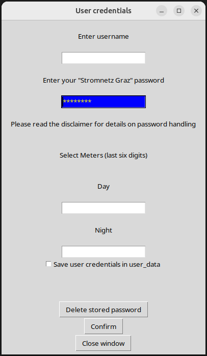
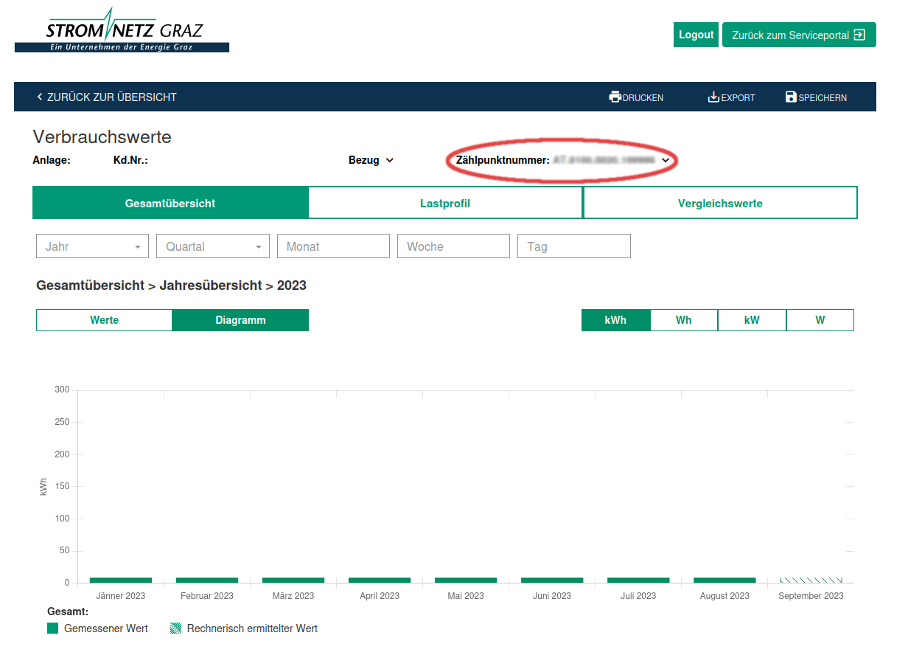
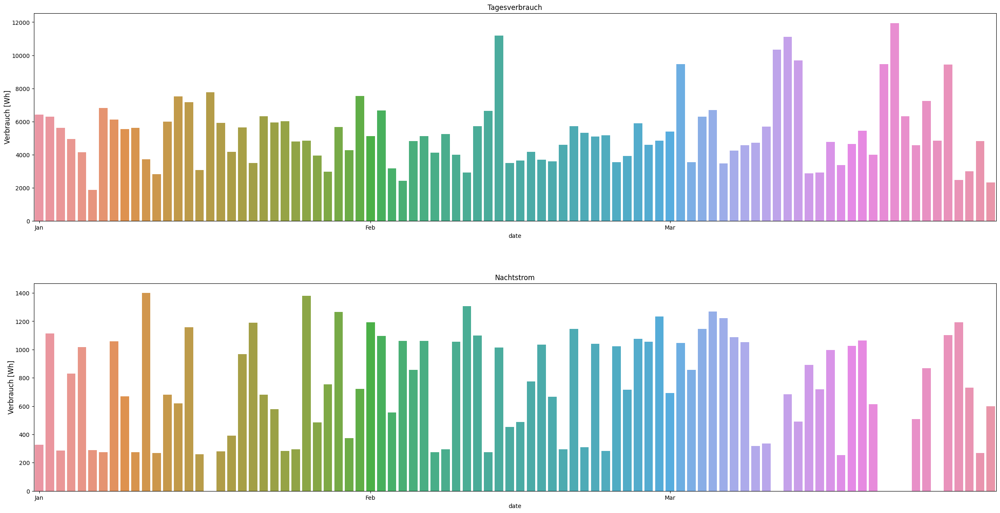

# 
**SMIT** 

**
 Smart Meter Interface Tool 
**   

 Download and plot your power usage 

## Intention

My main motivations for this application are to 
- simplify monitoring my power consumption
- strengthen my coding skills and learn how to integrate libraries I have not used so far 
- a playground for different methods to design applications
- showcase for my coding skills and what I'm playing around with

My goal is to make data which already exists easily accessible. I hope that this data
makes users aware of their power consumption patterns. Maybe some of them will then
use this knowledge to **save energy**.

**Thoughts on webscraping**  
Web scraping is always messy. If the "Stromnetz Graz" company changes anything at their website I have to rewrite the scraper. I can promise to push a fix to the main branch but can't make a statement about a time frame. To fix this **getting API access would be highly appreciated** but this is a whole different topic...

This is a hobby project and I am highly motivated to keep it going.

## Table of Contents

 * [Intention](#intention)
 * [Disclaimer](#disclaimer)
 * [Usage](#usage)
	* [Application run](#application-run)
	* [Dummy Mode](#dummy-usage)
	* [Live Data](#live-data-usage)
 * [Documentation](#documentation)
	* [Pytest Setup](#testing)
	* [Application Structure](#application-structure)
	* [Folder Structure](#folder-structure)
 * [Roadmap](#roadmap)
 * [Issues](#issues)
 * [Requirements](#requirements)
 * [Participation Guidlines](#participating-guidlines)
 * [Acknowledgements](#acknowledgements)
 * [License](#license)

## Disclaimer
The password is send in plain text to the login field. This is **not good practice** but with using a webscraper at the moment I see no other option. If you **save the password** it is stored in `./config/user_data.toml` encrypted with the public key generated by the program and stored in `./config` folder. The keys are included in `.gitignore` make sure to **not expose the private key**. If you accidentally expose the keys you can delete the key pair and a new one will be created automatically. You then have to enter the password again to encrypt it with the new key.

## Usage

- In project root folder open `Main.ipynb`.

At the moment the easiest way to use the application is to clone this repository.
In the future distributable versions are planned. I want to further investigate into the [PyInstaller](https://pyinstaller.org/en/stable/) library. Additionally for demonstration purposes I plan to integrate the [VsCode Devcontainer](https://code.visualstudio.com/docs/devcontainers/containers) feature.

### Dummy usage
This mode is used for demonstration purposes and testing via pytest.
No "Stromnetz Graz" account is needed.
The Gui and scraping modules are not used.
The dummy data from `./opt/dummy_user` folder is used to setup a application mockup.
This will create a temporary `.dummy` folder in the project directory.
At the beginning of each dummy run the temporary folder will be deleted and newly created.

### Live data usage

   
   
 
<ins><b><i> User Credentials GUI </i></b></ins>

Running with live data will first open a simple dialog to enter the "Stromnetz Graz" account data.
Username and password are provided by the electricity provider. Your meter numbers are either found in
the "Netzzugangsvertrag" under "Technische Details - Zählpunkt/Gerät"  from the electricity provider or you can get them online following these steps:

	
Get Meter Numbers

1. Open https://webportal.stromnetz-graz.at/login
2. Login
3. Choose "Auswertung"
4. In the "Zählpunktnummer" pull down menu you can see your meter numbers.

   
   
 
<ins><b><i> "Stromnetz Graz" Data Page </i></b></ins>

You can use the 'Save user credentials' option to store your credentials in the `user_data.toml` file.
This file is located in the `./config` folder. See the disclaimer for information on password
storage and handling.
The buttons do exactly what their respective name implies. Implementation details are explained
in the [documentation](#documentation) section.

### Example output
At the moment the output is a really simple overview of your power usage. In future releases the 
output will feature more detailed plots to get usefull insights regarding the own power consumption.

   
   
 
<ins><b><i> Power Usage Sample Plot </i></b></ins>

## Documentation
Detailed technical documentation for each class/method can be found here:

- [Application Modules](https://filedn.eu/liu4e7QL6NoXLInqRT2UAQu/SMIT/index.html) 
- [Pytest Setup](https://filedn.eu/liu4e7QL6NoXLInqRT2UAQu/tests/index.html)

The documentation for this project is done via docstrings. As format the [Google Style Guide](https://google.github.io/styleguide/pyguide.html) is used. I think it is good practice to invest time in writing detailed docstrings and as a free benefit the documentation is done on the fly.

At the moment I use the pdoc3 library to generate html output from the docstrings. In future I want to switch to sphinx in combination with the readthedocs theme. Ideally this leads to a more compact documentation and a simpler README file. 

### Testing

**All tests are run in dummy configuration**  

As test framework the pytest library is used.  
From the command line in the root directory run `tox` command.

__Pytest Setup__  
Tests are located in the `./tests` folder.  
For managing and running the tests `tox` is used.  
For each module a test file with the
module name and the prefix 'test_' is used.  

__Tox Configuration__  
Environment: Python 3.11  
Test Setup: [tox.ini](./tox.ini)  
Markers: [pyproject.toml](./pyproject.toml)  
   

### Application Structure

View

__Application modules__

- **application** - Provide core functionality
- **filehandling** - File operation related methods
- **filepersistence** - Preserve data via serialization
- **rsahandling** - Public key cryptography
- **scrapedata** - Selenium webdriver implementation
- **userinput** - Simple user credentials gui 

__Libraries__

- **Pickle** - Persist date values for automated scraping workflow
- **Pathlib** - Folder structure setup, Move files, Paths handling
- **Tomlkit** - Manage configs in `.toml` files
- **Logger** - Log Application behaviour
- **Rsa** - Encrypted password storage
- **Selenium Webdriver** - Scrape data
- **Tkinter** - Gui for user credentials
- **Pandas** - Create dataframes for further analysis
- **Pytest** - Test application setup
- **Pdoc** - Generate documentation

### Folder Structure

View

- `root` 
	- --> Project home
- `csv_raw` 
	- --> Folder for webdriver downloads   
	- --> Raw `.csv` files are stored in subdirectories
- `csv_workdir` 
	- --> Python working directory
	- --> Pandas input `.csv` files are stored in subdirectories
- `log` 
	- --> Logfiles
- `opt` 
	- --> **Dummy Configs** are stored in a subdirectory
	- --> Contains subdirectory for README files
	- --> Folder for develop files, testfiles... 
- `src` 
	- --> Source code folder
	- --> `SMIT` --> **Modules directory**
- `config` 
	- --> user config files, rsa-keys
- `docs`
	- --> **Pdoc3** generated modules documentation
	- --> Legal files
- `tests`
	- --> **Pytest** source folder
- `.dummy`
	- --> Get's created when application class is instantiated with **dummy option**
	- --> on each instantiation folder gets **deleted and newly created**
- `.tox`
	- --> Data for running tests

## Roadmap
This roadmap is in no particular order. The priorization depends on which topic catches me the most at a given time.

- API access -> Depends on availability of public API
- Implement 15min resolution measurements (user OPT IN needed at provider site)
- Switch from Jupyter Notebook to modern GUI
- Use Sphinx for documentation
- Implement database
- Create executable package
- More detailed data plots
- Enhance logging / Debug option
- Implement more electricity providers

## Issues
- Main.ipynb -> Log gets printed multiple times [#74](https://github.com/tmpck/strom/issues/74)
- Rsa Keys on initial run not working [#60](https://github.com/tmpck/strom/issues/60)
- SNG Data update not implemented [#43](https://github.com/tmpck/strom/issues/43)

## Requirements
The virtual environment was created with **Python 3.11** as base.  
See [requirements.txt](./requirements.txt) for all needed dependencies. 

## Participating Guidlines
- Input is appreciated!
- Please take the time to write **meaningful docstrings**
- We want to keep the code english, however we understand german.  

## Acknowledgements
I would like to thank [mike_landl](https://github.com/mike-landl) and [martinhecher](https://github.com/martinhecher) for all the code contributions, input on best practice, things to think about and generall 
guiding how to write clean code! 

## License
This project is developed under the [MIT License](LICENSE). 