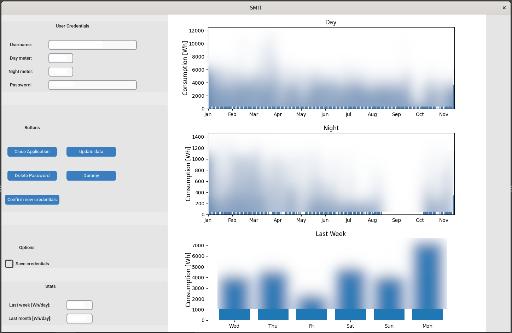

# <p align="center">**SMIT** </p>
**<p align='center'> Smart Meter Interface Tool </p>**   
<p align='center'> Download and plot your power usage </p>

## Intention

My main motivations for this application are to 
- simplify monitoring my power consumption
- strengthen my coding skills and learn how to integrate libraries I have not used so far 
- a playground for different methods to design applications
- showcase for my coding skills and what I'm playing around with

My goal is to make data which already exists easily accessible. I hope that this data
makes users aware of their power consumption patterns. Maybe some of them will then
use this knowledge to **save energy**.

**Thoughts on web scraping**  
Web scraping is always messy. If the "Stromnetz Graz" company changes anything at their website I have to rewrite the scraper. I can promise to push a fix to the main branch but can't make a statement about a time frame. To fix this **getting API access would be highly appreciated** but this is a whole different topic...

This is a hobby project and I am highly motivated to keep it going.

## Table of Contents

 * [Intention](#intention)
 * [Disclaimer](#disclaimer)
 * [Installation](#installation)
	* [Python package](#poetry-package-manager)
	* [Python venv](#virtual-environment)
	* [Docker](#docker)
 * [Usage](#usage)
	* [Initial Setup](#initial-application-setup)
	* [Live Data](#live-data-usage)
	* [Dummy Data](#dummy-setup)
 * [Documentation](#documentation)
	* [Pytest Setup](#testing)
	* [Application Structure](#application-structure)
	* [Folder Structure](#folder-structure)
 * [Roadmap](#roadmap)
 * [Issues](#issues)
 * [Requirements](#requirements)
 * [Participation Guidelines](#participating-guidelines)
 * [Acknowledgements](#acknowledgements)
 * [License](#license)

## Disclaimer
The password is sent in plain text to the login field. This is **not good practice** but with using a web scraper at the moment I see no other option. If you **save the password** it is stored in `./config/user_data.toml` encrypted with the public key generated by the program and stored in `./config` folder. The keys are included in `.gitignore` make sure to **not expose the private key**. If you accidentally expose the keys you can delete the key pair and a new one will be created automatically. You then have to enter the password again to encrypt it with the new key.

## Installation
### Poetry package manager
The main benefit of poetry in this project is that it automatically creates a virtual environment and manages all needed dependencies. 

- Clone repository
- `cd` into root folder
```
	poetry install
	poetry shell
	python main.py
```
### Virtual environment
- Clone the repository
- Use the `requirements.txt` file from `./config` folder.
- Run the application with ```python3 main.py```

### Docker

> [!Important]
> Docker needs to access the hosts window manager.

__Guide for Debian based systems__  
> [!Caution]
> For docker usage one has to allow docker to use the window manager on the host machine. This leads to several **security vulnerabilities** like key logging and the possibility to remote control the host machine. Technically this setup breaks the container isolation and you should handle with care. 

- Docker setup needed 
	- See [Debian guide](https://www.linuxcapable.com/how-to-install-docker-on-debian-linux/) for installing instructions on Debian based systems. 

- Add docker user to x-window group 
	
		xhost +local:<your_dockeruser>

- Clone repo and `cd` into project root folder
- Build with `-f` (specifying location of docker file) and `-t` (optionally, name and tag image)
- Don't forget the `.` at the end of the command!

		docker build -t <your_image_name>:<tag> -f .devcontainer/Dockerfile .

- Run container with following options:
	
		 docker run --env DISPLAY=$DISPLAY --volume /tmp/.X11-unix:/tmp/.X11-unix --name <your_container_name> <your_image_name>
  
	- Add `--rm` flag to remove the container after each use. No user data will be persisted or stored on your system.

## Usage

To start the application use   

	SMIT/python3 ./main.py

<p align="center">
   
  <br>
<br>
<ins><b><i> SMIT GUI </i></b></ins>
</p>


### Initial application setup

- Fill in user credentials
- Confirm new credentials (Button)
- Update data (Button)

See [Live Data usage](#live-data-usage) for instructions on getting the needed credentials from the service provider. The **confirm credentials button** will save the credentials to the momentarily running instance of the application. If you want to store the credentials permanently check the **save credentials checkbox** before confirming the credentials. See [Disclaimer](#disclaimer) for security thoughts on handling the password storage. The **update data button** triggers the login and scrape data routine. The plots will be automatically updated after the new data is scraped.

<details>
	<summary>Save credentials</summary>
</p>

You can use the 'Save credentials' option to store your credentials in the `user_data.toml` file. This file is located in the `./config` folder. See the disclaimer for information on password storage and handling. Implementation details are explained in the [documentation](#documentation) section.

</details>
</p>

The **dummy button** restarts the whole application with dummy data. See [Dummy setup](#dummy-setup) for information on this application mode.

### Visualized data
- Median power consumption per day 
	- Average over the last 7 days
	- Average over the last 30 days
- Power consumption per day
	- for day meter, overview 
	- for night meter, overview
- Sum of power consumption for the last 7 days

### Live data usage
Username and password are provided by the electricity provider. Your meter numbers are either found in
the "Netzzugangsvertrag" under "Technische Details - Zählpunkt/Gerät"  from the electricity provider, or you can get them online following these steps:

<details>
	<summary>Get Meter Numbers</summary>

1. Open https://webportal.stromnetz-graz.at/login
2. Login
3. Choose "Auswertung"
4. In the "Zählpunktnummer" pull down menu you can see your meter numbers.

<p align="center">
   
  <br>
<br>
<ins><b><i> "Stromnetz Graz" Data Page </i></b></ins>
</p>
</details>

### Dummy setup
- Activate with **Dummy Button** on Gui.

This mode is used for demonstration purposes and testing via pytest. No "Stromnetz Graz" account is needed. The scraping modules are not used. The dummy data from `./opt/dummy_user` folder is used to set up an application mockup. This will create a temporary `.dummy` folder in the project directory. At the beginning of each dummy run the temporary folder will be deleted and newly created.

## Documentation
Detailed technical documentation for each class/method can be found here:

- [Application Modules](https://filedn.eu/liu4e7QL6NoXLInqRT2UAQu/SMIT/index.html) 
- [Pytest Setup](https://filedn.eu/liu4e7QL6NoXLInqRT2UAQu/tests/index.html)

The documentation for this project is done via docstrings. As format the [Google Style Guide](https://google.github.io/styleguide/pyguide.html) is used. I think it is good practice to invest time in writing detailed docstrings and as a free benefit the documentation is done on the fly.

At the moment I use the pdoc3 library to generate HTML output from the docstrings. In future I want to switch to sphinx in combination with the readthedocs theme. Ideally this leads to a more compact documentation and a simpler README file. 

### Testing

**All tests are run in dummy configuration**  

As test framework the pytest library is used.  
From the command line in the root directory run `tox` command.

__Pytest Setup__  
Tests are located in the `./tests` folder.  
For managing and running the tests `tox` is used.  
For each module a test file with the
module name and the prefix 'test_' is used.  

__Tox Configuration__  
Environment: Python 3.11  
Test Setup: [tox.ini](./tox.ini)  
Markers: [pyproject.toml](./pyproject.toml)  
   
### Application Structure
<details>
<summary>View</summary>
</p>

__Application modules__

- **application** - Provide core functionality
- **filehandling** - File operation related methods
- **filepersistence** - Preserve data via serialization
- **rsahandling** - Public key cryptography
- **scrapedata** - Selenium webdriver implementation
- **gui** - Modules for Gui, grouped by frame 

__Libraries__

- **Pickle** - Persist date values for automated scraping workflow
- **Pathlib** - Folder structure setup, Move files, Paths handling
- **Tomlkit** - Manage configs in `.toml` files
- **Logger** - Log Application behavior
- **Rsa** - Encrypted password storage
- **Selenium Webdriver** - Scrape data
- **Tkinter** - GUI for user credentials
- **Pandas** - Create data frames for further analysis
- **Pytest** - Test application setup
- **Pdoc** - Generate documentation
</p>
</details>

### Folder Structure
<details>
<summary>View</summary>
</p>

- `root` 
	- --> Project home
- `csv_raw` 
	- --> Folder for webdriver downloads   
	- --> Raw `.csv` files are stored in subdirectories
- `csv_workdir` 
	- --> Python working directory
	- --> Pandas input `.csv` files are stored in subdirectories
- `log` 
	- --> Log files
- `opt` 
	- --> **Dummy Configs** are stored in a subdirectory
	- --> Contains subdirectory for README files
	- --> Folder for develop files, test files... 
- `src` 
	- --> Source code folder
	- --> `SMIT` --> **Modules directory**
- `config` 
	- --> user config files, rsa-keys
- `docs`
	- --> **Pdoc3** generated modules documentation
	- --> Legal files
- `tests`
	- --> **Pytest** source folder
- `.dummy`
	- --> Gets created when application class is instantiated with **dummy option**
	- --> on each instantiation folder gets **deleted and newly created**
- `.tox`
	- --> Data for running tests
</p>
</details>

## Roadmap
This roadmap is in no particular order. The prioritization depends on which topic catches me the most at a given time.

- API access --> Depends on availability of public API
- Implement 15min resolution measurements (user OPT IN needed at provider site)
- Use Sphinx for documentation
- Implement database
- Create executable package
- More detailed data plots
- Enhance logging / Debug option
- Implement more electricity providers

## Issues
Issues are managed via the projects [Github Issues](https://github.com/ChristianKoplenig/SMIT/issues) page.

## Requirements
The virtual environment was created with **Python 3.11** as base.  
See [requirements.txt](./requirements.txt) for all needed dependencies. 

## Participating Guidelines
- Input is appreciated!
- Please take the time to write **meaningful docstrings**
- We want to keep the code English, however we understand German.  


## Acknowledgements
I would like to thank [mike_landl](https://github.com/mike-landl) and [martinhecher](https://github.com/martinhecher) for all the code contributions, input on best practice, things to think about and general 
guiding how to write clean code! 

## License
This project is developed under the [MIT License](LICENSE). 
